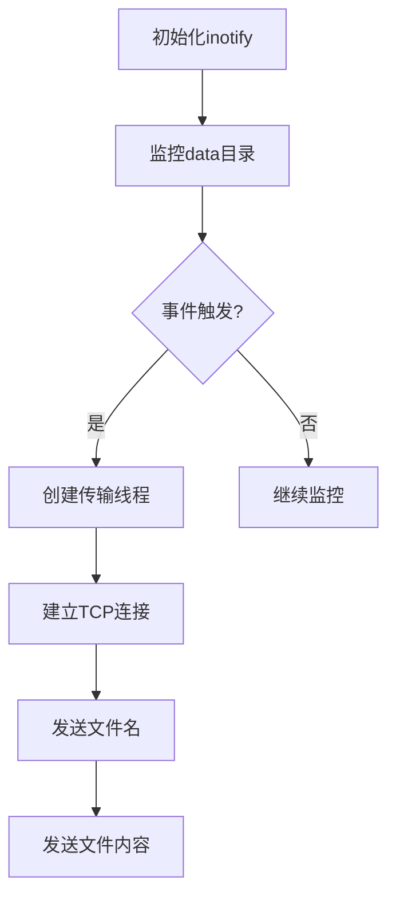

# 文件同步监控程序

## 项目简介
这是一个基于Linux inotify机制的文件监控同步程序，实时监控指定目录下的文件修改事件，并通过TCP协议将修改后的文件同步到远程服务器。适用于需要实时文件同步的场景。

## 功能特性
- 🕵️ 实时监控文件关闭写入事件（IN_CLOSE_WRITE）
- 🌐 使用TCP协议进行文件传输
- 🧵 多线程文件传输（每个文件独立线程）
- 🔒 基础信号处理（支持Ctrl+C优雅退出）

## 工作原理


## 快速开始

### 编译运行
```bash
gcc -o file_sync file_sync.c -lpthread
mkdir data  # 创建监控目录
./file_sync
```

### 前置条件
1. 服务器需预先启动在指定IP:PORT（默认172.20.6.238:8080）
2. 需要Linux内核支持inotify
3. 程序运行目录需要存在data子目录

## 代码结构
1. **网络连接**
   - `connect_to_server()` 建立TCP连接
   - 使用`send_all()`确保完整数据发送

2. **文件传输**
   - `send_file()`实现文件分段传输
   - 文件名长度使用网络字节序（htonl）

3. **事件监控**
   - inotify初始化与监控配置
   - 事件循环处理机制

4. **线程管理**
   - 每个文件创建独立传输线程
   - 使用strdup保证线程安全

## 不足之处
1. **连接管理**
   - 每个文件传输都新建连接（应复用连接）
   - 缺乏断线重连机制

2. **错误处理**
   - 部分错误直接exit未尝试恢复
   - 无传输失败重试机制

3. **性能问题**
   - 4096字节固定缓冲区
   - 无传输速率控制

4. **安全性**
   - 使用明文传输
   - 无身份验证机制

## 优化建议
1. **连接池管理**
   ```c
   // 伪代码示例
   #define MAX_CONN 5
   static int conn_pool[MAX_CONN];
   ```

2. **断点续传**
   - 增加文件校验（MD5/SHA1）
   - 记录传输进度

3. **协议优化**
   ```c
   // 建议协议格式
   struct {
       uint32_t magic;    // 协议标识
       uint32_t name_len;  // 文件名长度
       uint64_t file_size; // 文件大小
       uint8_t  checksum;  // 简单校验
   } header;
   ```

4. **配置化**
   ```json
   {
       "server_ip": "172.20.6.238",
       "server_port": 8080,
       "watch_dir": "./data",
       "buffer_size": 8192
   }
   ```

5. **安全增强**
   - TLS/SSL加密传输
   - 增加认证协议

## 扩展方向
1. 支持多目录监控
2. 添加文件删除同步功能
3. 实现双向同步
4. 增加传输进度显示
5. 支持配置文件热加载
